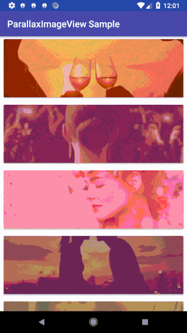

ParallaxImageView
====

[](https://search.maven.org/artifact/com.kazakago.parallaximageview/parallaximageview)
[](https://javadoc.io/doc/com.kazakago.parallaximageview/parallaximageview)
[](https://github.com/KazaKago/parallaximageview/actions?query=workflow%3ATest)
[](LICENSE.md)

The parallax ImageView for Android.



## Requirement

- Android 4.0.3 (API 15) or later

## Install

Add the following gradle dependency exchanging x.x.x for the latest release.

```groovy
implementation 'com.kazakago.parallaximageview:parallaximageview:x.x.x'
```

## Usage

Implement with `ParallaxImageView` instead of `ImageView`.

```xml
<?xml version="1.0" encoding="utf-8"?>
<android.support.constraint.ConstraintLayout
    xmlns:android="http://schemas.android.com/apk/res/android"
    xmlns:app="http://schemas.android.com/apk/res-auto"
    android:layout_width="match_parent"
    android:layout_height="wrap_content">

    <com.kazakago.parallaximageview.ParallaxImageView
        android:layout_width="match_parent"
        android:layout_height="128dp"
        app:src="@drawable/img_q1"/>

</android.support.constraint.ConstraintLayout>
```

or 

```kotlin
parallaxImageView.setImageResource(R.drawable.img_q1)
```

## Advanced

You can adjust the speed and direction of the parallax image.  

Set `forward` or `reverse` for `app:direction`.  
The default image parallax distance for `app:distance` is `50dp`.  

```xml
<com.kazakago.parallaximageview.ParallaxImageView
    android:layout_width="match_parent"
    android:layout_height="128dp"
    app:src="@drawable/img_q1"
    app:direction="reverse"
    app:distance="100dp"/>
```

## License

MIT License

Copyright (c) 2018 KazaKago

Permission is hereby granted, free of charge, to any person obtaining a copy of this software and associated documentation files (the "Software"), to deal in the Software without restriction, including without limitation the rights to use, copy, modify, merge, publish, distribute, sublicense, and/or sell copies of the Software, and to permit persons to whom the Software is furnished to do so, subject to the following conditions:

The above copyright notice and this permission notice shall be included in all copies or substantial portions of the Software.

THE SOFTWARE IS PROVIDED "AS IS", WITHOUT WARRANTY OF ANY KIND, EXPRESS OR IMPLIED, INCLUDING BUT NOT LIMITED TO THE WARRANTIES OF MERCHANTABILITY, FITNESS FOR A PARTICULAR PURPOSE AND NONINFRINGEMENT. IN NO EVENT SHALL THE AUTHORS OR COPYRIGHT HOLDERS BE LIABLE FOR ANY CLAIM, DAMAGES OR OTHER LIABILITY, WHETHER IN AN ACTION OF CONTRACT, TORT OR OTHERWISE, ARISING FROM, OUT OF OR IN CONNECTION WITH THE SOFTWARE OR THE USE OR OTHER DEALINGS IN THE SOFTWARE.
